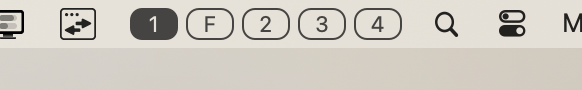
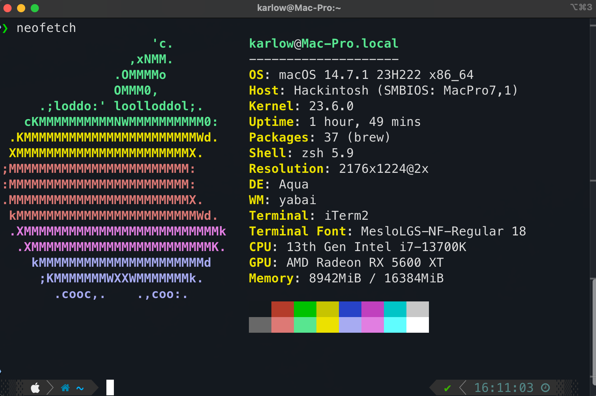

## **:smirk_cat:**
### skhd
- **Shortcuts**
    - cmd + return = open iTerm window
    - cmd + 0 = open Firefox
    - cmd + tab = go to next space (yabai)
    - cmd + escape = go to prev space (yabai)
---
### yabai
- ##### [yabai-indicator](https://github.com/xiamaz/YabaiIndicator) - show spaces in default macOS status bar 
    -  
- ##### [spacebar](https://github.com/cmacrae/spacebar) - lightweight status bar for macOS 
- **[JankyBorders](https://github.com/FelixKratz/JankyBorders) - add colored borders around windows**
    - add to ``yabairc`` $\rightarrow$ ``borders active_color=0xcfbbbbbb inactive_color=0xaa000000 width=2.0 hidpi=on &``
---
### nvim
- NvChad
- markdown-preview.nvim
- transparent.nvim
---
#### terminal
- iTerm2
- font: MesloLGS-NF-Regular
- [zsh theme](https://github.com/romkatv/powerlevel10k) - powerlevel10k
 

